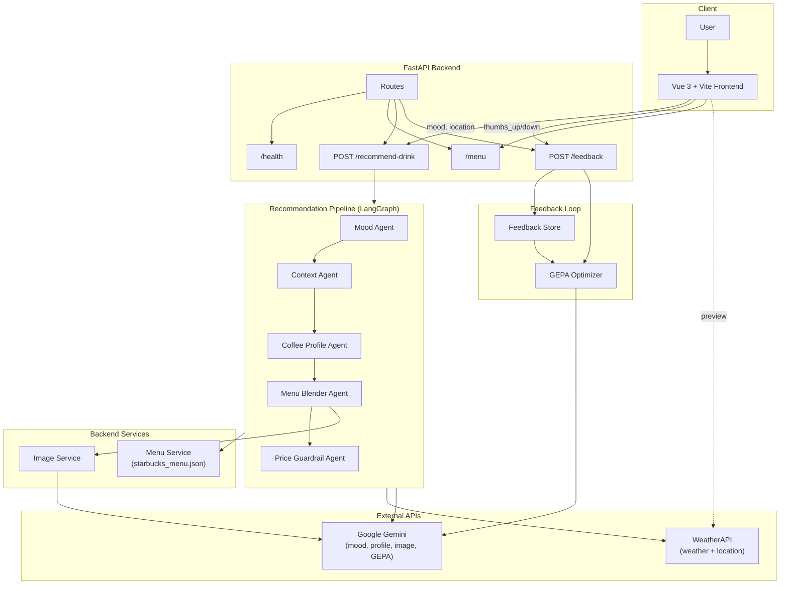
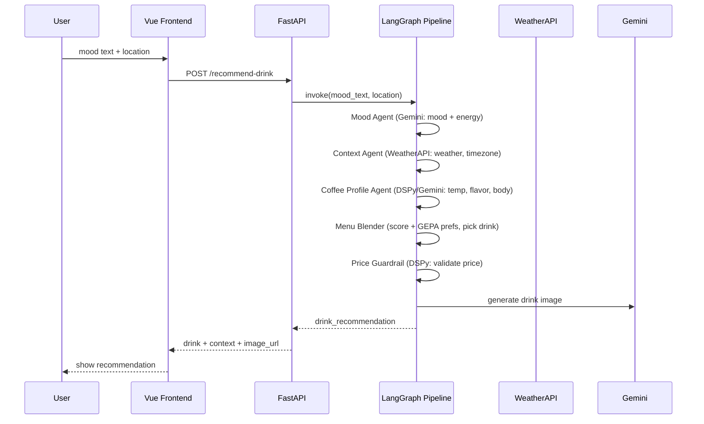

# Visual Barista AI — End-to-End Architecture

## Data flow (recommendation)

## Component summary

| Layer | Components |
|-------|------------|
| **Frontend** | Vue 3, Vite; mood/location input; drink cards; feedback (thumbs up/down); optional weather preview via WeatherAPI |
| **API** | FastAPI; CORS; `/health`, `/menu`, `POST /recommend-drink`, `POST /feedback`; debug routes under `/debug` |
| **Pipeline** | LangGraph DAG: Mood → Context → Coffee Profile → Menu Blender → Price Guardrail; shared `RecommendationState` |
| **Agents** | Mood (Gemini), Context (WeatherAPI + TZ), Coffee Profile (DSPy/Gemini), Menu Blender (scoring + GEPA), Price Guardrail (DSPy) |
| **External** | WeatherAPI (current weather by location), Google Gemini (mood, profile, image, GEPA reflection) |
| **Feedback** | In-memory feedback store; GEPA optimizer reads history and produces learned preferences for menu blender |
